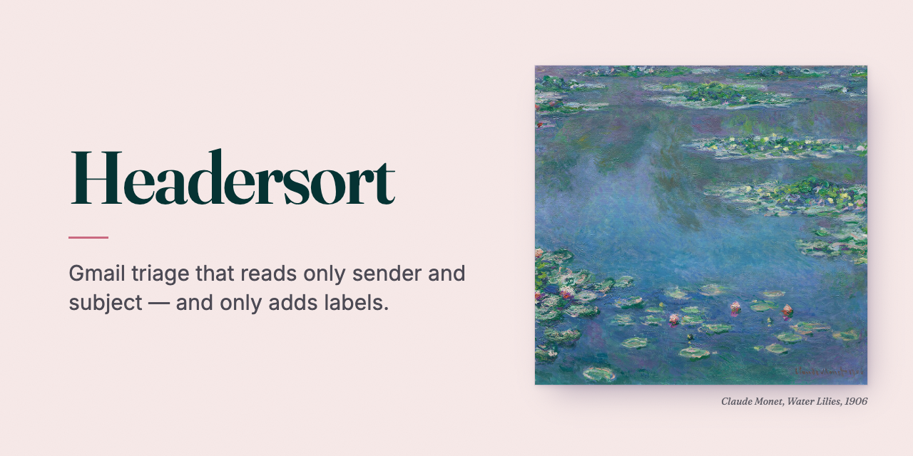
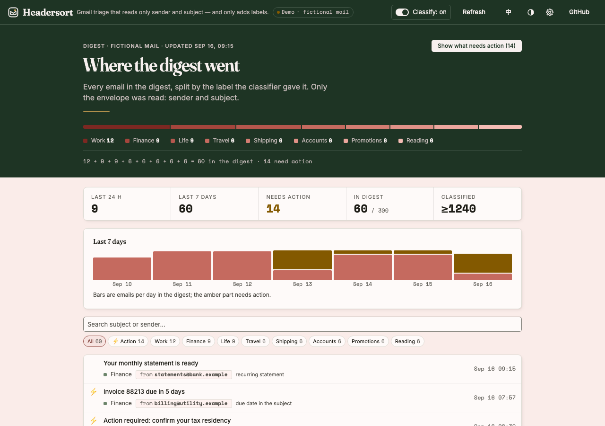
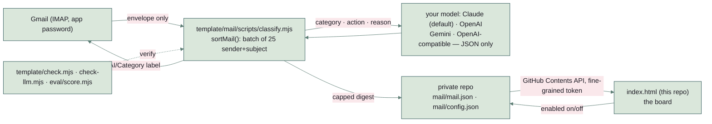

# Headersort



**Gmail triage that reads only sender and subject — and only adds labels.**

A scheduled GitHub Action reads new mail over IMAP, asks a small model to label each one from its sender and subject line, adds an `AI/…` label, and writes a capped digest into your private repo. One static HTML file renders the board. Nothing runs between the two daily runs, nothing costs anything at rest, and nothing ever reads a message body.

[](https://github.com/NickkkLian/Mail-Sorter/actions/workflows/check.yml)



**Live demo:** https://nickkklian.github.io/Mail-Sorter/?demo=1 — sixty fictional emails over seven days, every address on the reserved `.example` domain. The demo connects to no repository and no mailbox; its only network requests are the web fonts. English by default, 中文 toggle in the header.

## Four constraints, all mechanically checked

Anything that reads your mail should be able to say precisely how little of it it touched. `node template/check.mjs` runs the classifier core on 20 synthetic emails with mock adapters and fails if any of these break:

1. **The model sees the sender and the subject line. Never the body.** The check asserts the model input carries exactly `from` and `subject`, and includes a negative control: an adapter that leaks a body is caught.
2. **It only ever adds a label.** The mock mailbox throws on any verb other than *label* (and *move* only for categories you list in `archive_categories`).
3. **The digest is capped.** `keep_items` bounds the summary file so a JSON file used as a database cannot grow without limit; the check feeds 20 emails through a cap of 15.
4. **One switch turns it off.** `enabled: false` in `config.json` means nothing is fetched, nothing is labelled, and the digest is untouched; the workflow exits before touching anything.

## What the board shows

- **Counts** — last 24 h, last 7 days, mail that needs action, the digest window against its cap, and the cumulative total the classifier has processed (a lower bound once the window has rolled).
- **Where the digest went** — one bar per category; the counts add up to the window.
- **Seven-day trend** — emails per day, with the action-needed share in amber.
- **Filters and search** — by category, or just the mail that needs action; each row deep-links to the original message in Gmail by `Message-ID` and shows the model's one-line reason, so a wrong label is debuggable instead of mysterious. The classifier writes that reason twice — `reason` in the language of the subject line and `reason_en` in English — and English mode shows `reason_en`; rows written before a classifier produced it show no reason rather than one in another language. A reply or forward marker that a mail client put in front of the subject in its own language — a Chinese client's equivalents of *Fwd:* and *Re:*, say — is shown as `Fwd:` / `Re:` in English mode; the rest of the subject is the sender's own text and is shown as written.
- A connect card when no repository is set, a setup guide when the repository has no digest yet, an error with *Try again* when GitHub cannot be read (a refused token, no network), empty states when the digest or a filter is empty, dark and light themes, 375 px layout.

## How it fits together



| Concern | Approach |
|---|---|
| Schedule | GitHub Actions cron, twice a day. No server, no container, no always-on process |
| Mail access | IMAP with a Google **app password** — a scoped credential that can be revoked on its own, rather than full OAuth |
| Classification | A model of your choice — Claude Sonnet 5 by default, or OpenAI, Gemini, or any OpenAI-compatible server such as Ollama — on sender + subject only, batched 25 at a time; categories outside your config fall back to `other` |
| Storage | Two JSON files in a private repo: `mail.json` (the digest, capped) and `config.json` (categories, on/off switch) |
| Front end | One static HTML file, no build step, no dependencies beyond one web font. Reads the two JSON files through the GitHub Contents API |
| Secrets | The Gmail app password and the model key live in the private repo's Actions secrets (names in `template/SECRETS.md`). The browser only ever holds a fine-grained GitHub token, in `localStorage`, scoped to Contents on one repo |
| Content-Security-Policy | A `<meta>` right after `<meta charset>`: scripts only from this site's own files and from the board's three inline scripts, pinned by sha256; no `'unsafe-inline'`, no `'unsafe-eval'`, no inline event handlers (buttons name their action in `data-act`). The token shares an origin with the author's other GitHub Pages sites and the board shows subjects and senders written by strangers, so the browser itself refuses a script from another host or text run as code. `node check-csp.mjs` (in CI) fails when the policy is missing, loosened or out of step with the page |
| Failure mode | Missing credentials or `enabled: false` → the script exits 0 before logging in and changes nothing; a missing digest → the board renders a setup guide; a read that fails (refused token, no network) → the board says which and offers *Try again* |

## Running your own

1. **App password** — Google Account → Security → 2-Step Verification → App passwords → create one.
2. **Copy `template/` into your private data repo** (`.github/workflows/mail-sync.yml`, `mail/scripts/classify.mjs`, `mail/config.json`, `package.json`). Also copy `mail/scripts/llm.mjs`. Edit the categories in `mail/config.json`. A category is shown by its `label`, which is whatever you called the Gmail label; if you keep the mailbox in one language and read the board in another, add `label_en` (or `label_zh`) beside it — `{ "key": "job", "label": "Bewerbungen", "label_en": "Jobs" }` — and the board uses that. Without one it falls back to a name for the key, then to the label itself, so a category this board has never heard of keeps your words instead of going blank. Under Settings → Secrets and variables → Actions add the Gmail secrets and one model key listed in `template/SECRETS.md`; to use something other than Claude, set the repository variables `LLM_PROVIDER` and `LLM_MODEL` (and `LLM_BASE_URL` for an OpenAI-compatible server).
3. **First run** — Actions → *Mail Classify* → Run workflow, with `backfill_days` set if you want the existing inbox sorted in one pass. After that it runs on its own.
4. **Open the board** — serve your own copy of `index.html` with your repository filled in: set `owner` and `repo` in `DEFAULTS` near the top of its script (the public page has no repository set, so there is nothing for it to load). Then open Settings and paste a fine-grained GitHub token with Contents read/write on that one repo. It is stored in your browser and never written anywhere.

```sh
node template/check.mjs
node template/check-llm.mjs
node eval/score.mjs
node eval/score.mjs --break
node check-csp.mjs             # the board's Content-Security-Policy; --write after editing an inline script, --self-test breaks it
```

### Model providers

`mail/scripts/llm.mjs` calls each provider's API directly with `fetch` — no SDK, so the template's only dependency is the IMAP client. Nothing provider-specific is required: the prompt asks for a JSON array in plain words, and anything that does not parse becomes `other`. Keys go in request headers only.

| Provider | Configure | What has been run |
|---|---|---|
| Claude (Anthropic) | default · secret `ANTHROPIC_API_KEY` | `node template/check-llm.mjs`: request and reply format against a local mock of the documented API, end to end through `sortMail` to `AI/…` labels. **Not run against the live API for this revision.** |
| OpenAI | variables `LLM_PROVIDER=openai`, `LLM_MODEL` · secret `OPENAI_API_KEY` | Same mock checks (sends `max_completion_tokens`, no `temperature`). Should work per OpenAI's documentation; **not run live.** |
| Google Gemini | variables `LLM_PROVIDER=gemini`, `LLM_MODEL` · secret `GEMINI_API_KEY` | Same mock checks (key in the `x-goog-api-key` header). Should work per Google's documentation; **not run live.** |
| OpenAI-compatible | variables `LLM_PROVIDER=openai-compatible`, `LLM_MODEL`, `LLM_BASE_URL` · optional secret `LLM_API_KEY` | Same mock checks. **Not run against a real Ollama, LM Studio or vLLM server.** A GitHub-hosted runner can only reach a server with a public address. |

`eval/headers.json` holds 40 synthetic sender+subject pairs (five per category). `node eval/score.mjs` scores cached model output against them and prints the keyword baseline next to it; envelope classification is easy enough that the baseline alone reaches 38/40, which is exactly why the eval reports both.

That run has been made: 2026-09-22, `claude-haiku-4-5-20251001`, the default at the time. The default is now `claude-sonnet-5` (Claude Opus 5.5 and Sonnet 5 are the only models the author's apps use); Sonnet 5 has **not** been scored on this set, and the cache below is still the Haiku run. **The keyword baseline scored 38/40 (95%) and the model 37/40 (93%)** — on this set the model is a little worse than the keywords, not better. Its three misses are the envelopes where the subject names one thing and belongs to another: a tax-residency notice read as an account message, a biometrics appointment read as an account message, and a flash sale on fares read as travel rather than promotion. That is the argument for the order the product actually uses — keywords first, the model for what they do not catch — rather than an argument for the model.

Without the cache the eval reports **NOT RUN** (exit 2) rather than a number; `--break` is the negative control. This is a small evaluation set, not a formal evaluation pipeline — and `eval/llm-cache.json` is the whole of what that run left behind. It records the provider, model and date, and nothing in this repository shows a request went over the network, so a hand-written cache would be indistinguishable from it.

## Limits and what is not verified here

- The template has been exercised with mock adapters and a dry run only; it has not been run against a live Gmail account for this revision. The IMAP label call falls back from `messageFlagsAdd` to `messageCopy` depending on how Gmail exposes labels — confirm on your account before relying on it.
- Category quality depends on the model and on subject lines alone; the reason shown per row is the model's, not a fact.
- The board shows at most `keep_items` emails and at most 150 rows per filter.
- The scheduled workflow and its script run in your private repo, not here — this repository is the board plus a template.

## Files

```
index.html                 the entire board: tokens, layout, i18n dictionary, GitHub Contents client, renderer, demo data
check-csp.mjs              writes and checks the board's Content-Security-Policy (there is no build step)
template/                  the Action to copy into a private repo (workflow · classify.mjs · llm.mjs · config.json · package.json · SECRETS.md · check.mjs · check-llm.mjs)
eval/headers.json          40 synthetic envelopes → expected category · eval/score.mjs scores cached model output
docs/screenshot-board.png  README screenshot
```

## License

MIT — see [LICENSE](LICENSE).
